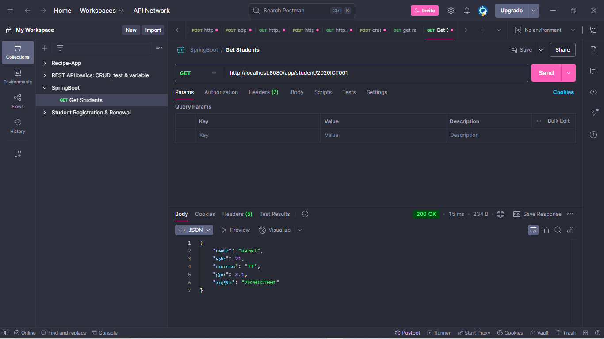

# springbootDay03Practicals

## Output Screenshots

Below are the screenshots of the API responses:

1. **Get Single Student (`/app/student`)**
   

2. **Get Student by ID (`/app/student/2020ICT002`)**
   

3. **Get Students Aged 20-25 (`/app/student/age-between`)**
   

4. **Get Students Sorted by GPA (`/app/student/sorted-by-gpa`)**
   
